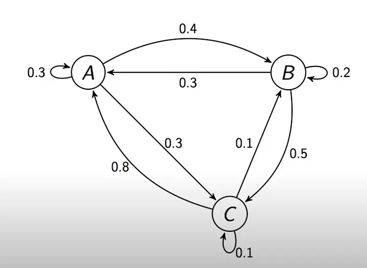
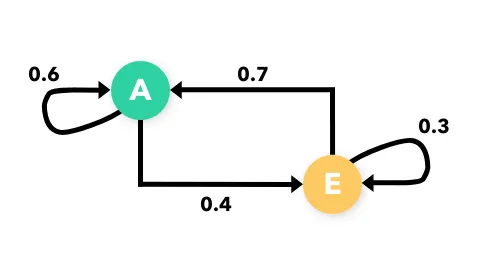
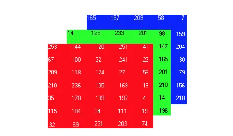

Markov Text Generator

📌 Sobre o Projeto

O Markov Text Generator é um gerador de textos baseado em cadeias de Markov. O projeto analisa um corpus de texto e usa um modelo probabilístico para gerar novas sequências coerentes com o estilo do material de entrada.

🔗 Exemplo de Cadeia de Markov

🚀 Funcionalidades

Análise de texto e geração de modelo probabilístico.

Geração de novos textos baseados em dados de entrada.

Possibilidade de definir o tamanho das cadeias para maior controle sobre a coerência textual.

🛠 Tecnologias Utilizadas

O projeto foi desenvolvido utilizando:

Python

Bibliotecas: numpy, random, collections

📂 Estrutura do Projeto

📦 Como Instalar

Clone o repositório:

git clone https://github.com/marcovins/markov_text_generator.git

Acesse o diretório do projeto:

cd markov_text_generator

Instale as dependências:

pip install -r requirements.txt

▶️ Como Usar

Prepare um arquivo de texto e coloque-o na pasta data/.

Execute o treinamento do modelo:

python src/train.py data/sample.txt

Gere um texto baseado no modelo:

python src/generate.py

🧪 Testes

Para rodar os testes automatizados:

pytest tests/

📄 Licença

Este projeto está sob a licença MIT - veja o arquivo LICENSE para mais detalhes.

✨ Contribuições

Sinta-se à vontade para abrir issues e pull requests! Qualquer melhoria ou sugestão é bem-vinda. 😊

